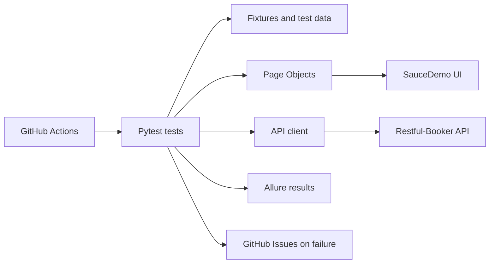
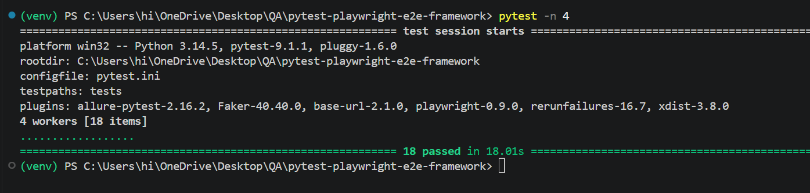
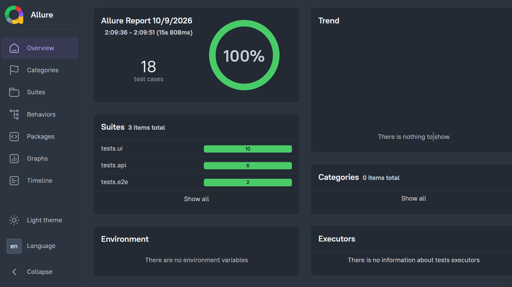
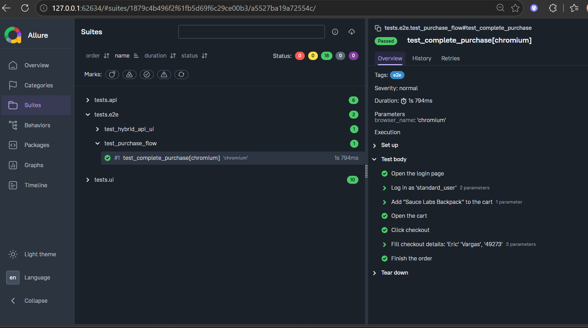
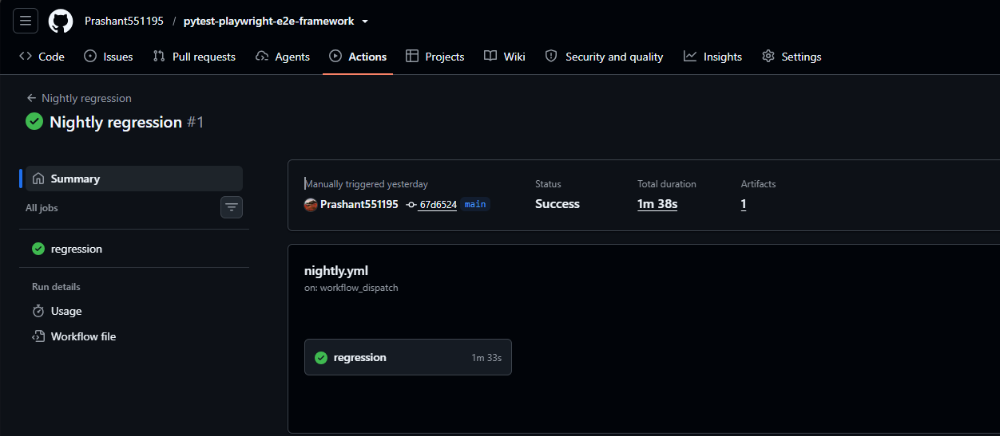
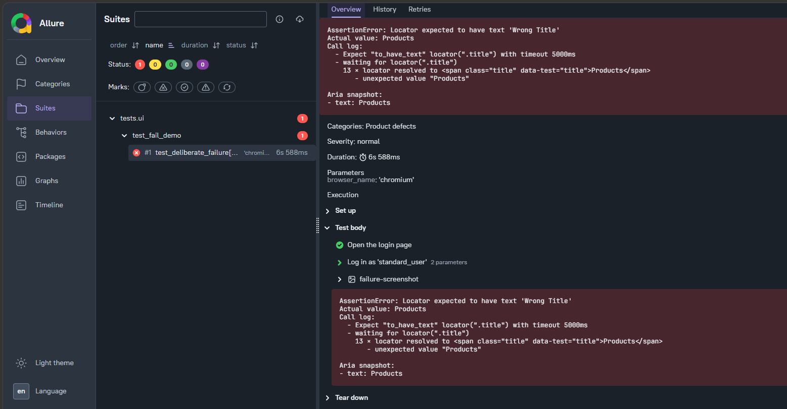
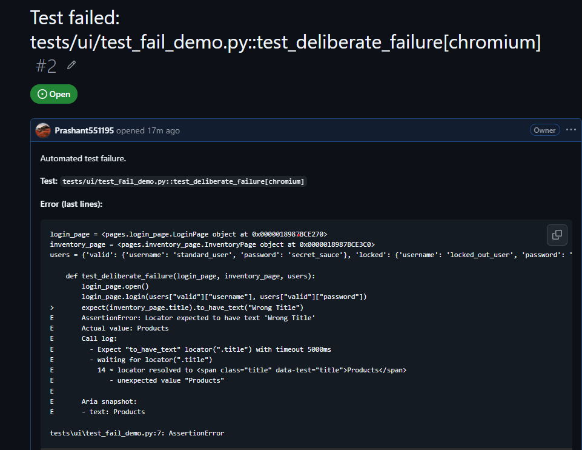

# Pytest Playwright E2E Framework

UI, API and end-to-end test automation framework built with **Playwright (Python)** and **Pytest**, using the Page Object Model. Reports with Allure, failure evidence, automatic GitHub issues and CI with GitHub Actions.

**Applications under test (public practice apps)**
- [SauceDemo](https://www.saucedemo.com): e-commerce web app (UI and E2E tests)
- [Restful-Booker](https://restful-booker.herokuapp.com): REST API (API tests)

This is a self-initiated portfolio project. Two practice apps are used because no single one offers both a full UI and a documented CRUD API. The framework shows the same approach a real project would use for its web UI and its backend API.

## Architecture


## Tech stack
- Python, Playwright (Python), Pytest, pytest-playwright
- Requests (API client)
- Faker (test data), python-dotenv (configuration)
- Allure (reporting)
- pytest-xdist (parallel runs), pytest-rerunfailures (retries)
- Pillow (visual comparison), axe-playwright-python (accessibility)
- GitHub Actions (CI), Git and GitHub

## Features
- Page Object Model: locators and actions kept in one place per page
- Pytest fixtures for page objects, test users and generated checkout data
- Data-driven tests with JSON data and Faker
- API client with tests for create, read, update, delete and a full booking lifecycle
- Hybrid test: data created through the API, used in the UI flow, then verified through the API again
- Allure reports with step-level detail and failure screenshots
- Screenshot, trace and video kept for failed tests only
- GitHub issue created automatically for a failed test, with a duplicate check
- Parallel and cross-browser runs (Chromium, Firefox, WebKit)
- GitHub Actions: smoke tests on every push and pull request, full regression nightly
- Visual comparison test and axe-core accessibility scan
- Configuration through environment variables, no hardcoded credentials
- Test markers: `smoke`, `regression`, `e2e`, `api`, `visual`, `a11y`

## Test coverage (18 tests)
| Area | Tests |
|------|-------|
| UI sanity | page title check, add item to cart |
| Login | valid login, invalid login, locked-out user |
| Cart | add item, add two items, remove item |
| E2E | login, add to cart, checkout, order confirmation |
| API | token, create, get, update, delete, full lifecycle |
| Hybrid | API data setup, UI checkout, API verification |
| Visual | login page screenshot comparison |
| Accessibility | axe-core scan, no critical violations |

## Project structure
```
├── .github/workflows/   # smoke.yml and nightly.yml
├── api/                 # API client for Restful-Booker
├── components/          # reusable UI components (placeholder)
├── config/              # settings loaded from .env
├── data/                # test data (users.json)
├── docs/                # screenshots used in this README
├── pages/               # Page Objects: login, inventory, cart, checkout
├── snapshots/           # visual baseline images
├── utils/               # data factory, GitHub issue helper, visual helper
├── tests/
│   ├── ui/              # login, cart, visual and accessibility tests
│   ├── api/             # booking API tests
│   └── e2e/             # business flow and hybrid API + UI test
├── conftest.py          # shared fixtures and failure hook
├── pytest.ini           # markers and run options
└── requirements.txt
```

## Setup
```bash
git clone https://github.com/Prashant551195/pytest-playwright-e2e-framework.git
cd pytest-playwright-e2e-framework
python -m venv venv
venv\Scripts\activate
pip install -r requirements.txt
playwright install
```

Create a `.env` file in the project root:
```
BASE_URL=https://www.saucedemo.com
SAUCE_USER=standard_user
SAUCE_PASSWORD=secret_sauce
API_BASE_URL=https://restful-booker.herokuapp.com
GITHUB_TOKEN=your_token_here
GITHUB_REPO=your-username/your-repo
CREATE_GITHUB_ISSUES=false
```
`GITHUB_TOKEN` is only needed when `CREATE_GITHUB_ISSUES=true`. The token needs Issues: read and write on the repo.

## Run tests
```bash
pytest -n 4                     # all tests in parallel
pytest -m smoke                 # smoke tests
pytest -m api                   # API tests
pytest -m e2e                   # end-to-end flows
pytest -m a11y -s               # accessibility scan
pytest -m visual                # visual test (local only)
pytest --headed --slowmo 500    # watch the browser
pytest -n 4 --browser chromium --browser firefox --browser webkit
```

## Reports and failure evidence
```bash
pytest
allure serve allure-results
```
The Allure CLI needs Java installed. Failed tests also keep a screenshot, video and trace in `test-results`. Open a trace with `playwright show-trace <path-to-trace.zip>`.

To create GitHub issues for failures, set `CREATE_GITHUB_ISSUES=true` in `.env`. An issue is skipped if an open one with the same title exists.

## CI/CD
- **Smoke tests** (`smoke.yml`): run on every push and pull request.
- **Nightly regression** (`nightly.yml`): runs daily on Chromium, Firefox and WebKit in parallel, and creates issues for failures.
- Results are uploaded as workflow artifacts.

## Screenshots

**All tests passing**





**Allure report overview**





**Test steps in Allure**





**GitHub Actions: smoke tests**


**GitHub Actions: nightly regression**





**Failed test in Allure (deliberate failure for the demo)**





**Auto-created GitHub issue**





**Playwright trace of the failed test**


## Notes and limitations
- SauceDemo and Restful-Booker are public practice apps. Restful-Booker is a shared server and can be slow or reset data, so the hybrid test has a controlled retry.
- Visual baselines were created on Windows with Chromium, so visual tests are local only and are excluded from CI.
- The accessibility test fails only on critical violations.

## Possible next steps
- Run the suite in Docker
- Publish the Allure report to GitHub Pages
- Add more page objects and reusable components